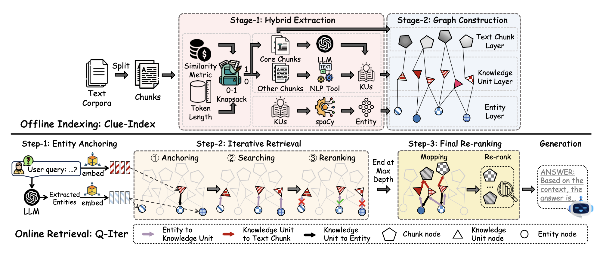
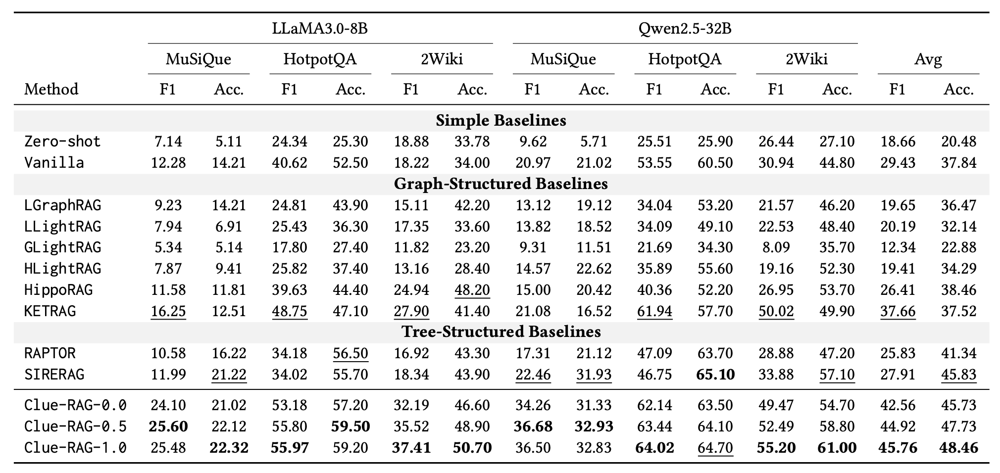

# ClueRAG: Towards Accurate and Cost-Efficient Graph-based RAG via Multi-Partite Graph and Query-Driven Iterative Retrieval.


## Introduction 

**​Clue-RAG​**​ is a novel ​​Retrieval-Augmented Generation (RAG)​​ framework that enhances LLM question answering by efficiently retrieving and integrating structured knowledge from a ​​multi-partite graph index​​.

🔍 ​​Key Features​​:

✅ ​​Multi-partite Graph Index​​ – Combines ​​text chunks, knowledge units, and entities​​ for fine-grained semantic retrieval

🚀 ​​Hybrid Extraction​​ – Reduces LLM token usage while maintaining high-quality knowledge disambiguation

🔍 ​​Q-Iter Retrieval​​ – Query-driven iterative search with ​​semantic matching & constrained graph traversal​​

🏗️ **Clue-RAG** 's ​​offline indexing​​ (Clue-Index) transforms raw text into a structured knowledge graph through two stages: 1.
​​Hybrid Extraction​​ 2. Graph Construction​​. Q-Iter follows an intelligent 3-phase approach: 1. Entity Anchoring 2. Iterative Retrieval 3. Final Re-ranking.
  

## Performance 

Overall performance of RAG solutions. The best and second-best results among the ten competitor solutions (excluding
the Clue-RAG series) in each column are highlighted in bold and underlined, respectively. Notebly, it outperforms the strong
baseline KETRAG (KDD 2025) [](https://arxiv.org/abs/2502.09304) [](https://github.com/waetr/KET-RAG) by 21.53%/29.16% in average F1/Acc., while also surpassing
another competitive baseline SIRERAG (ICLR 2025) [](https://arxiv.org/abs/2412.06206) [](https://github.com/SalesforceAIResearch/SiReRAG) by 5.75% in average F1/Acc.

  

## Setup Environment

### 1. Create a Python 3.10 Environment

```
conda create -n cluerag python=3.9 -y
pip install -r requirements.txt
```

### 2. Install spaCy

```
python -m spacy download en_core_web_trf
```
or download the `en_core_web_trf-3.8.0` model from [spaCy model releases](https://github.com/explosion/spacy-models/releases/download/en_core_web_trf-3.8.0/en_core_web_trf-3.8.0.tar.gz), then 

```
pip install en_core_web_trf-3.8.0.tar.gz
```

### 3. Quick Start

⚙️ **Configure parameters**: All hyperparameters are located in `utils/config.py`

📊 **Data**: The benchmark dataset used in this project is located in the [`data/`](./data) directory. They are multi-hop QA dataset widely adopted by the Graph-based RAG research community. 

🚀 **Run the main script**: (from the project root directory):
```
python main.py
```

📂 **Output Directory**: When running experiments, results are automatically saved with this naming pattern: outputs/{dataset_name}/{select_metric}_{alpha}/

**Example**:  
If you test with:
- dataset_name: `2wikimultihopqa`  
- select_metric: `COSINE`  
- alpha value: `1`  

Your results will be saved in:  
`outputs/2wikimultihopqa/COSINE_1.00/`

The output folder will contain:
- `logs`: stores the whole log files.
- `extraction_cache.pkl`: stores the extraction result (e.g., knowledge units and entities).
- `graph_cache.json`: stores the graph relevant data.
- `selection_cache.pkl`: stores the hybrid selection result.
- `milvus.db`: stores the embeddings of three kinds of nodes.
- `result.json`: stores the generation result.
- `retrieval_results.json`: stores the retrieval result

**Please cite and 🌟 us if you find it helpful!**
```
@misc{su2025clueragaccuratecostefficientgraphbased,
      title={Clue-RAG: Towards Accurate and Cost-Efficient Graph-based RAG via Multi-Partite Graph and Query-Driven Iterative Retrieval}, 
      author={Yaodong Su and Yixiang Fang and Yingli Zhou and Quanqing Xu and Chuanhui Yang},
      year={2025},
      eprint={2507.08445},
      archivePrefix={arXiv},
      primaryClass={cs.IR},
      url={https://arxiv.org/abs/2507.08445}, 
}
```

